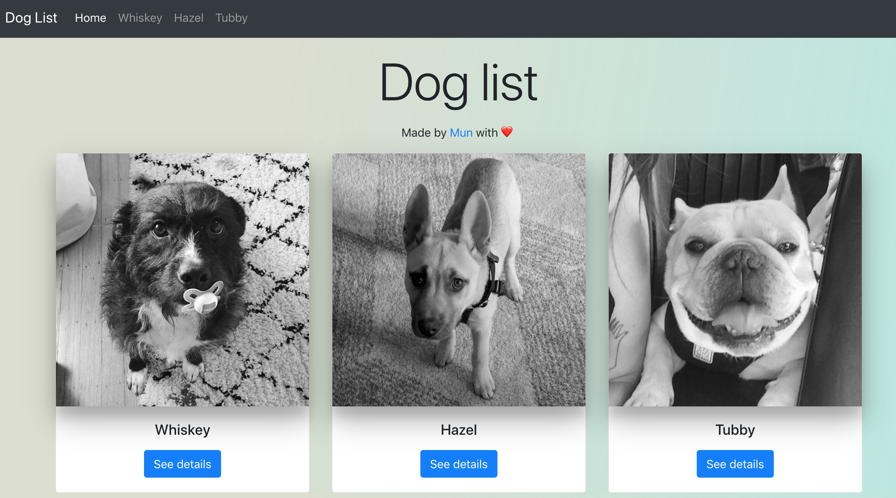
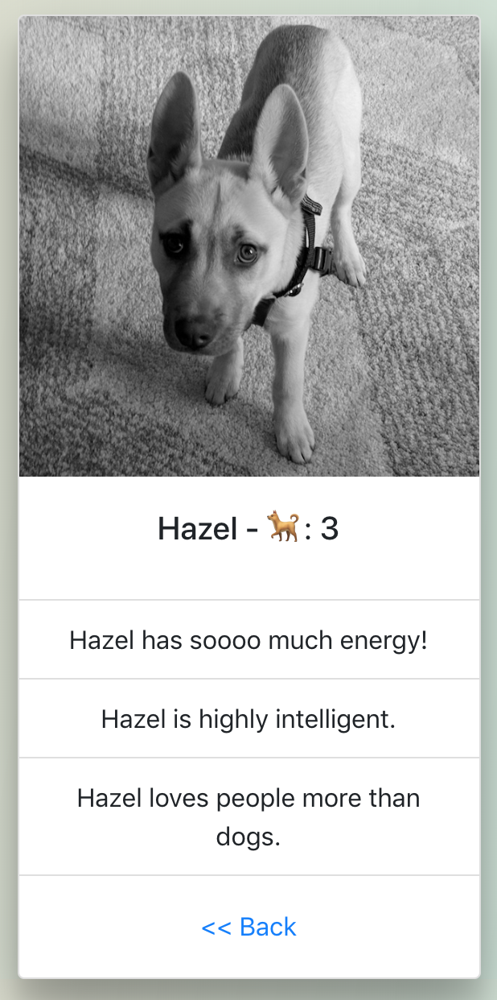

# Dog list 🐕

Transition is with React router. See demo at: [Doglist by Mun](https://flamboyant-raman-357e00.netlify.com)

## Features

- [x] Show dog list.
- [x] See dog detail.
- [x] Navbar to see dog detail.
- [x] Bootstrap framework.
- [x] React router.

## Screenshots

 

 

## Up & Running

- Run `npm install`
- Run `npm start` to check.
